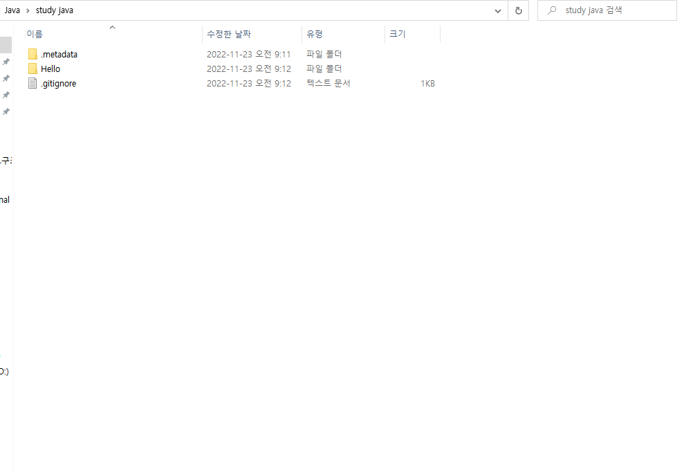

github + vscode + extension : markdown all in one
,paste image
md확장자 파일 생성 후 사이드뷰 활성화할 것.

1. 인터넷에서 사진을 드래그 앤 드롭 방식으로 vscode 에디터로
   shift 누른채로 사진을 원하는 위치에 놓는다.

2. 로컬(내컴퓨터)안의 사진을 붙여넣어보기 시도

ㄴ 실패(이미지 인식 안 된다)

3. extension : paste image를 사용
   원하는 이미지를 복사해 클립보드상에 있으면
   에디터의 넣기 원하는 위치에 ctrl+alt+v하면 된다(성공)

asdf
